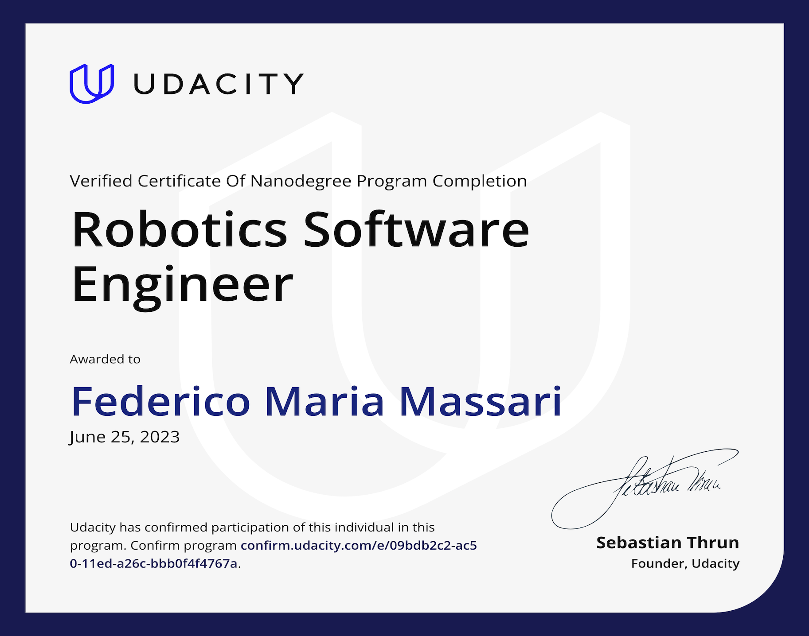
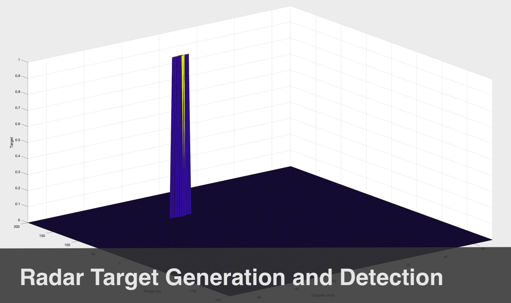
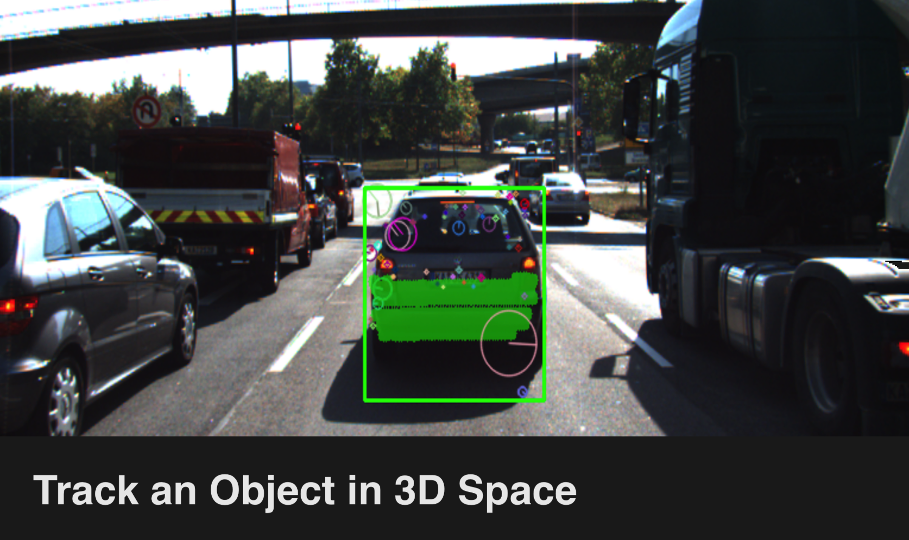
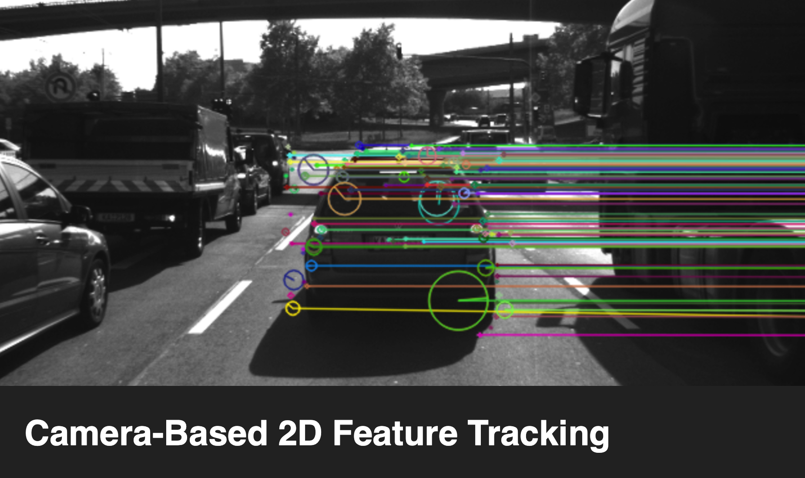
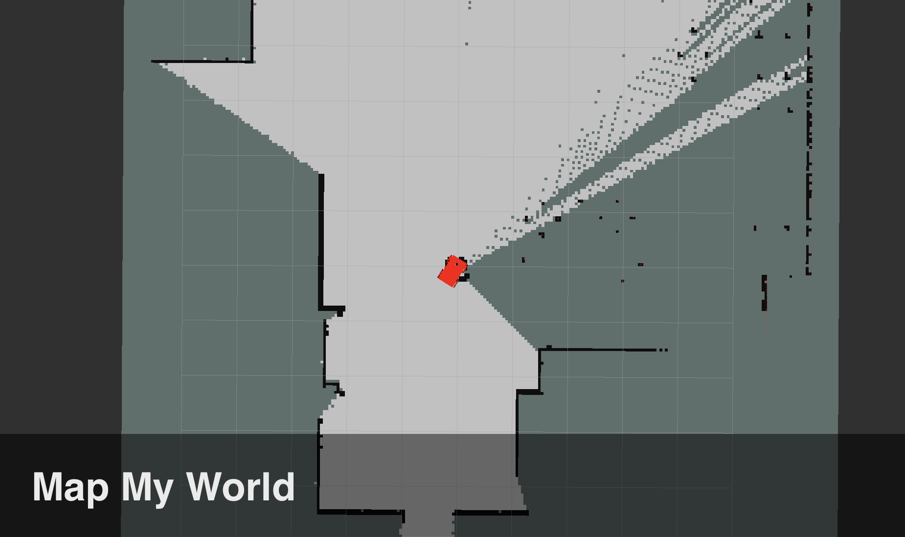
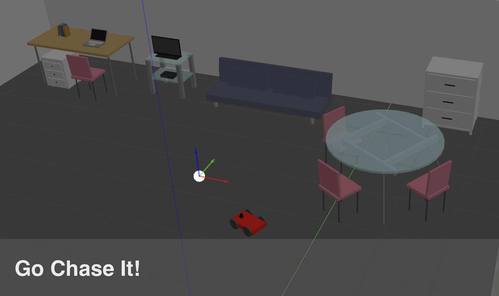

### Hi there! 👋 I'm Federico.

I'm a software developer with a keen interest in autonomous systems and robotics.

- 🔭 I’m currently working on fusing LiDAR and radar data using Unscented Kálmán Filter.
- 🌱 I’m currently learning sensor fusion.
- 👯 I’m looking to collaborate on 6502 assembly projects.

My latest certifications:

  

My latest projects (stack):

  
  
  
  
  
  
  
  

<!--
**federicomariamassari/federicomariamassari** is a ✨ _special_ ✨ repository because its `README.md` (this file) appears on your GitHub profile.

Here are some ideas to get you started:

- 🔭 I’m currently working on ...
- 🌱 I’m currently learning ...
- 👯 I’m looking to collaborate on ...
- 🤔 I’m looking for help with ...
- 💬 Ask me about ...
- 📫 How to reach me: ...
- 😄 Pronouns: ...
- ⚡ Fun fact: ...

You can check my main page at federicomariamassari.github.io
-->
